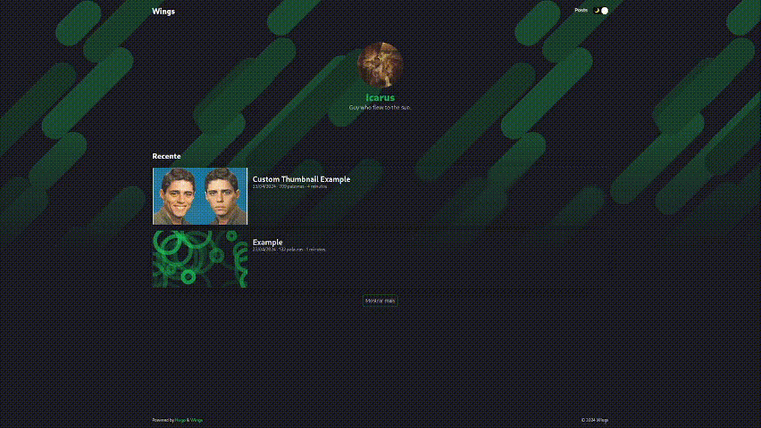

# Wings

<big>All you need, lightweight, minimalistic Hugo theme that doesn't sacrifice on its looks.</big>

<small>Heavily inspired by [Blowfish](https://blowfish.page/).</small>




## Features

* Almost no JavaScript
    * Only to handle not system dark/light themes.
* Thumbnail for posts
    * Support most of image types, including .GIF and .SVG.
* Easy to change color scheme
    * All you need to do is put your favorite colors in <code>assets/css/color_scheme.css</code>.
* Development structure fairly organized
    * Makes it easy to modify to your needs.
* Most recent posts
    * Show the first 3 most recent posts (can be configured).
* All posts page
    * Uses <code>archive</code> as a repository to all your posts and separates them by section.
* Words per post and estimated reading time
    * Cool information to display.

## Installation

Clone this repository to your <code>your-hugo-site/themes/</code> folder

### Linux/Windows

Inside your Hugo site directory, run

```shell
git clone https://github.com/icarochiabai/wings.git themes/wings/
```

## Configuration

### Home background image

It searches for any image named "background" in <code>assets/images/</code> and use it as background for the home page. Just change it to your favorite image and all things will work out. If it doesn't find any or has trouble loading the selected image, it will display a clean background.

### Home profile image

Just like the home background image, it will use any image named "author_profile" inside <code>assets/images/</code> and use it as the profile image for the author section. It won't display anything if he can't find or render the image.

### Posts thumbnail image

When a post is created it will automatically use the <code>assets/images/thumbnail.svg</code> as the default thumbnail and, just like the home background, you can change the default thumbnail by changing this file. It works for all types of image.

If you want a post to have a custom thumbnail, you must create a directory for this post and, inside his directory, add the image as "thumbnail".

Quick example below:

```
cd your-hugo-site

# Suppose inside /content/ you have a /posts/ folder and want to add a new post to it

hugo new content posts/example-post/index.md

# It will generate the default index.md file and you are free to modify it as you wish
# Inside the posts/example-post/ folder created, we want to add our thumbnail

mv ~/Downloads/chico-buarque-de-hollanda.jpg posts/example-post/thumbnail.jpg

# Done!
```

### Color scheme

Just mess with the colors code inside <code>assets/css/color_scheme.css</code> and use your favorite colors!

### Details

Currently it only has 'pt-br' language support.

Somethings are explained inside <code>hugo.toml</code> file, check it out.

#### Site icon

You can change the icon by changing the <code>static/favicon.ico</code> file.

## Contributing

I hope this encourages you to add new things or to even make a whole new theme based on this one. Feel free to contribute and develop things using this theme and, if you do, reach to me because I would love to see it!

Currently we only have 'pt-br' language support, it would be awesome if you want to help adding translations.
